# 🍕 FoodSeva

A full-stack food ordering web application built with Java and Spring Boot.


---

# 🌐 Live Demo

👉 [Click here to view FoodSeva](https://foodseva.up.railway.app/)

---

# 📌 About the Project

FoodSeva is a full-stack food ordering web application where users can register, login, browse the food menu, add items to cart, place orders, and manage their orders seamlessly — all in one platform.

---

# ✨ What You Can Do in FoodSeva

- 👤 Register & Login — Create account and securely login
- 🍽️ Menu Page — Browse all available food items
- 🛒 Cart — Add your favourite food items to cart
- 💳 Payment — Proceed to checkout and make payment
- 📦 Order Management — Track and manage your orders
- 🔐 Authentication — Secure user login and registration

---

# 🏗️ Architecture

MVC Architecture (Model - View - Controller)

- Controller Layer → Handles HTTP requests
- Service Layer → Business logic
- Repository Layer → Database operations
- Database → Stores all data

```mermaid
flowchart TD

subgraph group_bootstrap["Bootstrap"]
  node_app(("Application<br/>boot app<br/>[Application.java]"))
  node_initializer(("Servlet Init<br/>servlet bootstrap"))
  node_webxml["web.xml<br/>servlet config<br/>[web.xml]"]
  node_properties["Config"]
  node_tests["Tests<br/>spring test"]
end

subgraph group_web["Web Layer"]
  node_userctl["User<br/>controller"]
  node_restctl["Restaurants<br/>controller"]
  node_menuctl["Menu<br/>controller"]
  node_cartctl["Cart<br/>controller"]
  node_checkoutctl["Checkout<br/>controller"]
  node_fallbackctl["Fallback<br/>controller"]
  node_views["JSP Views<br/>server-rendered ui"]
end

subgraph group_domain["Domain"]
  node_usersvc["User Service<br/>[UserService.java]"]
  node_restsvc["Restaurant Service"]
  node_menusvc["Menu Service<br/>[MenuService.java]"]
  node_checkoutsvc["Checkout Service"]
  node_usermodel["User Model<br/>entity/form<br/>[UserModel.java]"]
  node_restaurantmodel["Restaurant Model<br/>entity"]
  node_menumodel["Menu Model<br/>entity<br/>[MenuModel.java]"]
  node_cartmodel["Cart Model<br/>cart state<br/>[CartModel.java]"]
  node_cartitem["Cart Item<br/>cart line<br/>[CartItemModel.java]"]
  node_checkoutmodel["Checkout Model<br/>checkout state<br/>[CheckOutModel.java]"]
  node_orderitem["Order Item<br/>order line"]
end

subgraph group_persistence["Persistence"]
  node_userrepo[("User Repo")]
  node_restrepo[("Restaurant Repo")]
  node_menurepo[("Menu Repo")]
  node_checkoutrepo[("Checkout Repo")]
  node_orderrepo[("Order Repo")]
end

subgraph group_assets["Assets"]
  node_navbar["Navbar<br/>shared partial<br/>[navbar.jsp]"]
  node_styles["CSS<br/>static assets"]
  node_images["Images<br/>static assets"]
end

node_app -->|"starts"| node_userctl
node_app -->|"starts"| node_restctl
node_app -->|"starts"| node_menuctl
node_app -->|"starts"| node_cartctl
node_app -->|"starts"| node_checkoutctl
node_initializer -->|"deploys"| node_webxml
node_userctl -->|"uses"| node_usersvc
node_restctl -->|"uses"| node_restsvc
node_menuctl -->|"uses"| node_menusvc
node_cartctl -->|"uses"| node_checkoutsvc
node_checkoutctl -->|"uses"| node_checkoutsvc
node_fallbackctl -->|"renders"| node_views
node_userctl -->|"renders"| node_views
node_restctl -->|"renders"| node_views
node_menuctl -->|"renders"| node_views
node_cartctl -->|"renders"| node_views
node_checkoutctl -->|"renders"| node_views
node_views -.->|"includes"| node_navbar
node_views -.->|"loads"| node_styles
node_views -.->|"loads"| node_images
node_usersvc -->|"reads/writes"| node_userrepo
node_restsvc -->|"reads"| node_restrepo
node_menusvc -->|"reads"| node_menurepo
node_checkoutsvc -->|"writes"| node_checkoutrepo
node_checkoutsvc -->|"writes"| node_orderrepo
node_usersvc -->|"uses"| node_usermodel
node_restsvc -->|"uses"| node_restaurantmodel
node_menusvc -->|"uses"| node_menumodel
node_checkoutsvc -->|"uses"| node_cartmodel
node_checkoutsvc -->|"uses"| node_cartitem
node_checkoutsvc -->|"uses"| node_checkoutmodel
node_checkoutsvc -->|"uses"| node_orderitem
node_userctl -.->|"binds"| node_usermodel
node_checkoutctl -.->|"binds"| node_cartmodel
node_properties -.->|"configures"| node_usersvc
node_properties -.->|"configures"| node_checkoutsvc
node_tests -.->|"verifies"| node_app

classDef toneBlue fill:#dbeafe,stroke:#2563eb,stroke-width:1.5px,color:#172554
classDef toneAmber fill:#fef3c7,stroke:#d97706,stroke-width:1.5px,color:#78350f
classDef toneMint fill:#dcfce7,stroke:#16a34a,stroke-width:1.5px,color:#14532d
classDef toneRose fill:#ffe4e6,stroke:#e11d48,stroke-width:1.5px,color:#881337
classDef toneIndigo fill:#e0e7ff,stroke:#4f46e5,stroke-width:1.5px,color:#312e81

class node_app,node_initializer,node_webxml,node_properties,node_tests toneBlue
class node_userctl,node_restctl,node_menuctl,node_cartctl,node_checkoutctl,node_fallbackctl,node_views toneAmber
class node_usersvc,node_restsvc,node_menusvc,node_checkoutsvc,node_usermodel,node_restaurantmodel,node_menumodel,node_cartmodel,node_cartitem,node_checkoutmodel,node_orderitem toneMint
class node_userrepo,node_restrepo,node_menurepo,node_checkoutrepo,node_orderrepo toneRose
class node_navbar,node_styles,node_images toneIndigo
```



---


# 🛠️ Tech Stack

| Layer | Technology |
|------|-------------|
| Language | Java |
| Framework | Spring Boot |
| ORM | Hibernate / JPA |
| Build Tool | Maven |
| Deployment | Railway |

---

# ✅ Features

- ✅ User Registration & Login
- ✅ Browse Food Menu
- ✅ Add Items to Cart
- ✅ Payment & Checkout
- ✅ Place Orders
- ✅ Order Management
- ✅ Secure Authentication

---

# 📁 Project Structure

```bash
src/
├── controller/
├── service/
├── repository/
├── model/
└── application.java
```

---

# ⚙️ How to Run Locally

## 1. Clone the Repository

```bash
git clone https://github.com/Abhishek2004-bot/food-order-app.git
```

## 2. Configure application.properties

Add your database configuration.

## 3. Run the Application

```bash
mvn spring-boot:run
```

## 4. Open in Browser

```bash
http://localhost:8080
```

---

# 👨‍💻 Author

**Abhishek S L**

- GitHub: https://github.com/Abhishek2004-bot
- LinkedIn: https://www.linkedin.com/in/abhishek-sl/
